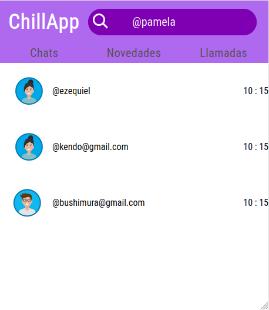
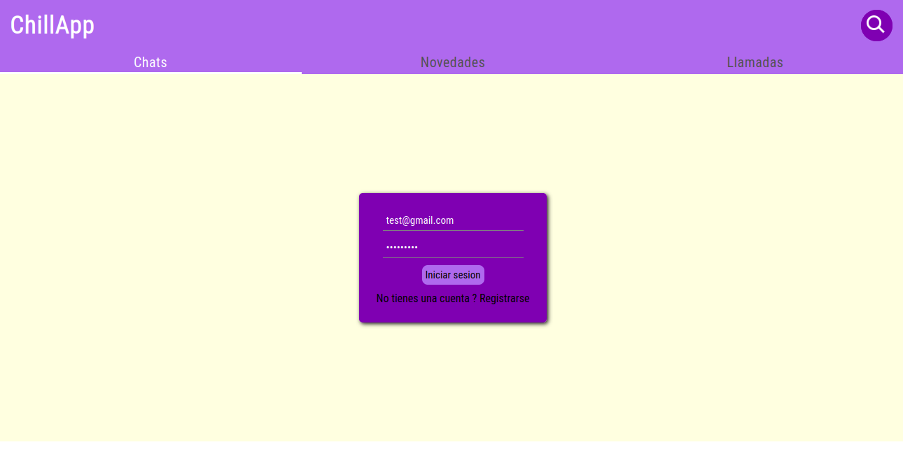
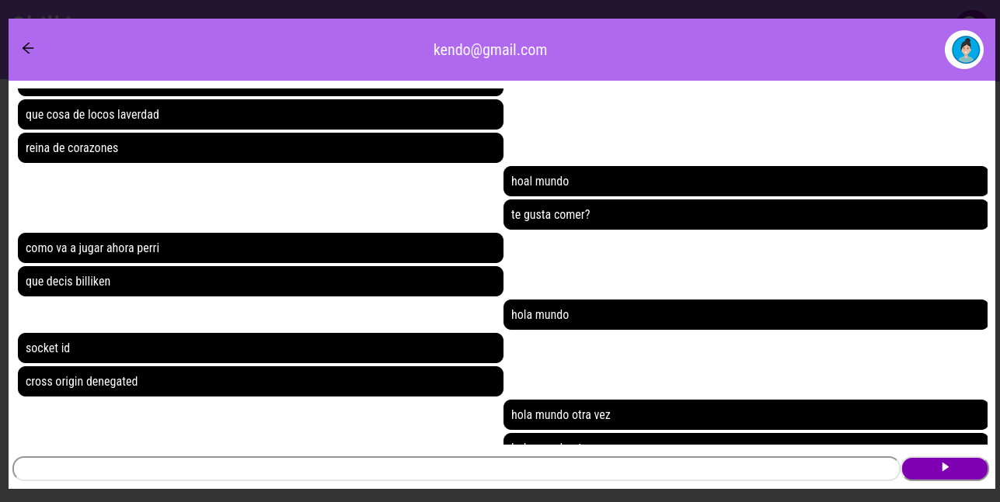

<h1>ChillApp overview</h1>

Este proyecto tiene como objetivo principal la creación de un sistema de chat personalizado diseñado para su uso entre amigos y familiares. Además de ofrecer un medio de comunicación para círculos cercanos, el proyecto se concibe como una plataforma para la aplicación y perfeccionamiento de buenas prácticas de desarrollo, incluyendo Clean Code (Código Limpio), Clean Architecture (Arquitectura Limpia), TDD (Desarrollo Guiado por Pruebas), y la implementación de diversas tecnologías y herramientas. La iniciativa busca proporcionar una experiencia de aprendizaje práctica al interactuar con usuarios reales, fomentando la aplicación de estándares de calidad y explorando soluciones tecnológicas variadas. Este enfoque integral tiene como objetivo el desarrollo de un sistema de chat robusto y eficiente mientras se promueven las mejores prácticas de la industria del desarrollo de software.

Esta aplicacion aun esta en desarrollo. Aqui podras encontrar algunas imagenes de como se ve el proyecto

<h3>Seccion del Chats </h3>

 - en esta seccion vas a poder buscar con quien chatear o seleccionar usuarios que ya les   hayas mandamo mensaje anteriormente

 
 
 
 
 
 
 
 
 
 
 
 
 
 
 

<h3>Seccion de Autentificacion</h3>

 - en esta vista podras registrarte o iniciar tu cuenta ya creada.

 
 
 
 
 
 
 
 
 

<h3>Seccion de Chat</h3>

